# AI Productization Tracker

A small research app that translates LLM, agent and tooling updates from frontier AI labs into productization signals — hand-tagged by category (research / productizing / mature product) and annotated with a "why it matters" note.

**[Live demo](https://ai-productization-tracker.vercel.app)** &nbsp;·&nbsp; [Watch as MP4](docs/architecture.mp4)



## What it tracks

12 labs — Anthropic, OpenAI, Google DeepMind, Meta FAIR, Mistral, DeepSeek, Cohere, AI2, Reka, Qwen, Black Forest Labs, Moonshot. ~70 items across model releases, papers, benchmarks, tooling, product launches, and safety announcements. Each entry includes a short summary and a POV "why it matters" annotation.

## Architecture

**Marginal cost per refresh: $0.** Firecrawl's free tier covers the crawl (~46 credits used of the 1000/month budget). Extraction is run inside a Claude Code session covered by the Max subscription — no Anthropic API spend. Hosting is free on Vercel's Hobby tier.

The interesting trade-off is the extraction step. The obvious solution is to pipe scraped markdown through the Anthropic or OpenAI API, but for a weekly-refresh personal project that's real money over time. Using Claude Code as the extractor trades automation for zero marginal cost.

## Stack

- **Frontend:** Vite 6 + React 19 + TypeScript + Tailwind CSS v4
- **Crawler:** Node script using `@mendable/firecrawl-js`
- **Hosting:** Vercel
- **Data:** static JSON imported at build time

## Run locally

```bash
# Frontend
cd ai-productization-tracker
npm install
npm run dev          # http://localhost:5173

# Refresh the feed (requires FIRECRAWL_API_KEY in .env at repo root)
cd ..
npm install
npm run crawl
```

Crawler config: per-lab URLs in `crawl_plan.json`, output to `data/raw/<lab>/<slug>.md`. Cache TTL is 7 days. The extraction step from `data/raw/` to `data/curated/news.json` is currently a manual Claude Code pass.

## Status & known limits

- DeepMind and AI2 publish without per-item dates on their listing pages — those entries cluster on placeholder dates
- Meta's `/research` is on Firecrawl's blocklist; Meta items come from `/blog/` only
- Categorization and "why it matters" notes are hand-curated and opinionated

## License

MIT
